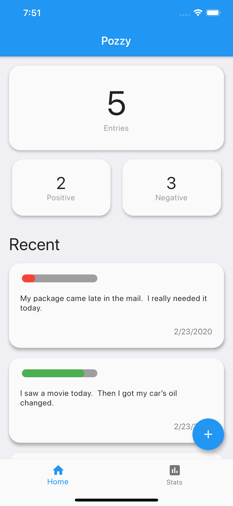
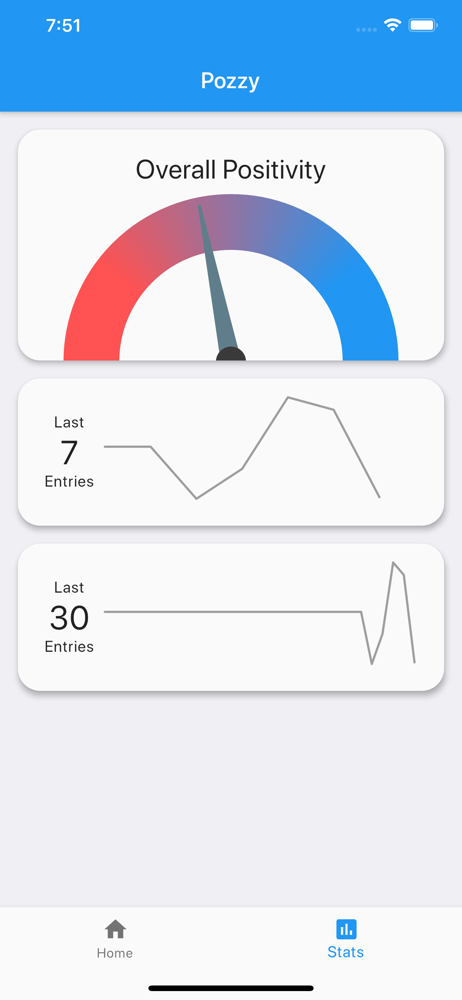
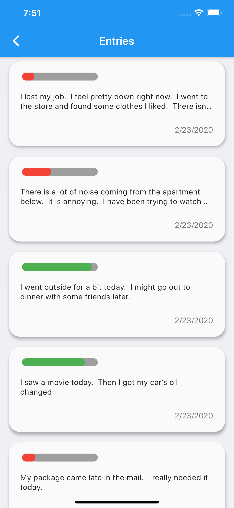

# Pozzy

An app for seeing how positive you are.

Use Pozzy like a journal to log your thoughts and feelings and Pozzy will use NLP processing to determine how positive or negative you've been.

## Features

- See the positivity of each entry you create
- View graphs depicting trends in your recent entries
- Get an overview of how positive you have been overall

  
  
  
